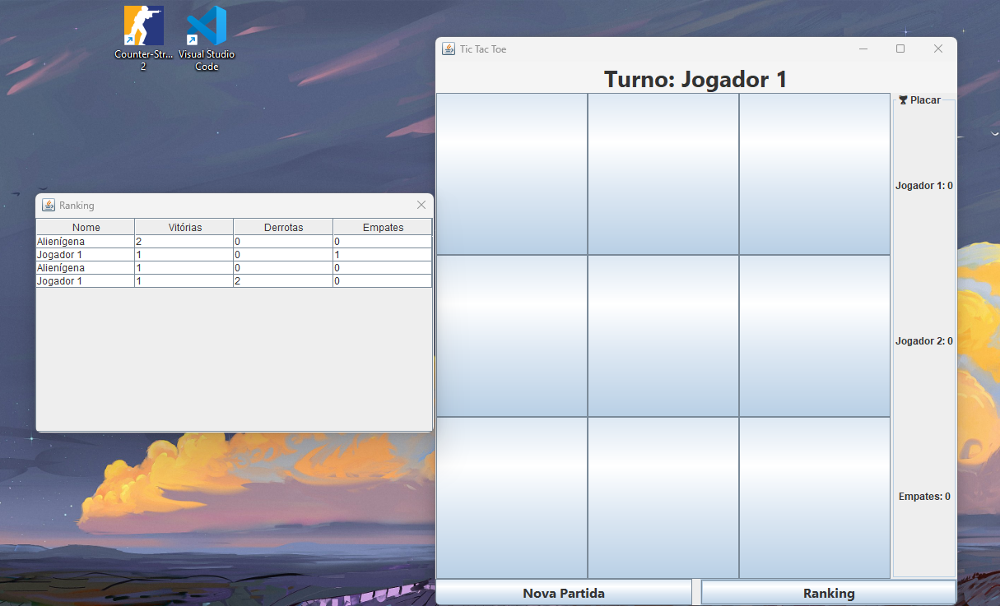

## Sobre o Projeto

Este projeto foi desenvolvido originalmente durante o segundo semestre do curso de graduação, na disciplina de Programação Orientada a Objetos (POO), utilizando Java.

A primeira versão foi implementada para execução em modo console (CMD), aplicando conceitos como:

- Programação Orientada a Objetos
- Encapsulamento
- Herança
- Polimorfismo
- Arquitetura MVC
- Persistência de dados por serialização

Posteriormente, o projeto foi revisitado como forma de estudo e aprimoramento pessoal, sendo expandido com uma interface gráfica desenvolvida em Java Swing.

O objetivo dessa evolução foi praticar o desenvolvimento de interfaces gráficas, reutilização de código, separação de responsabilidades e manutenção de software orientado a objetos, aproveitando a lógica já existente da versão original.

Dessa forma, o repositório contém tanto a versão console quanto a versão gráfica do jogo, permitindo comparar diferentes formas de interação utilizando a mesma base de regras de negócio.
